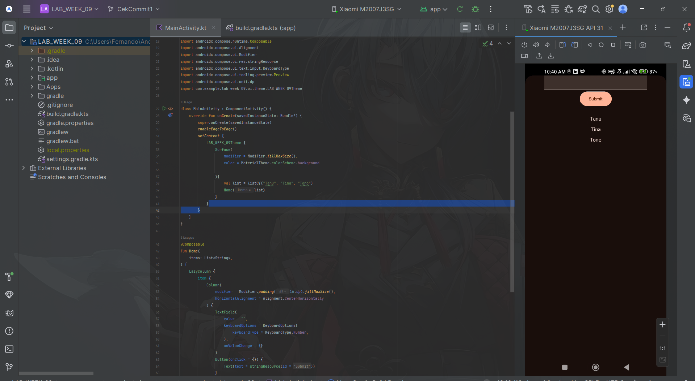
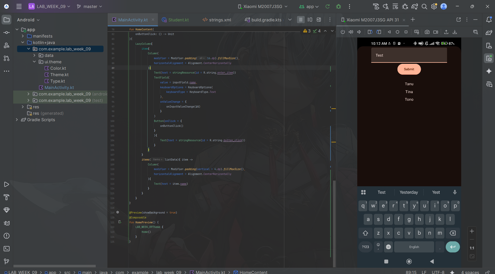
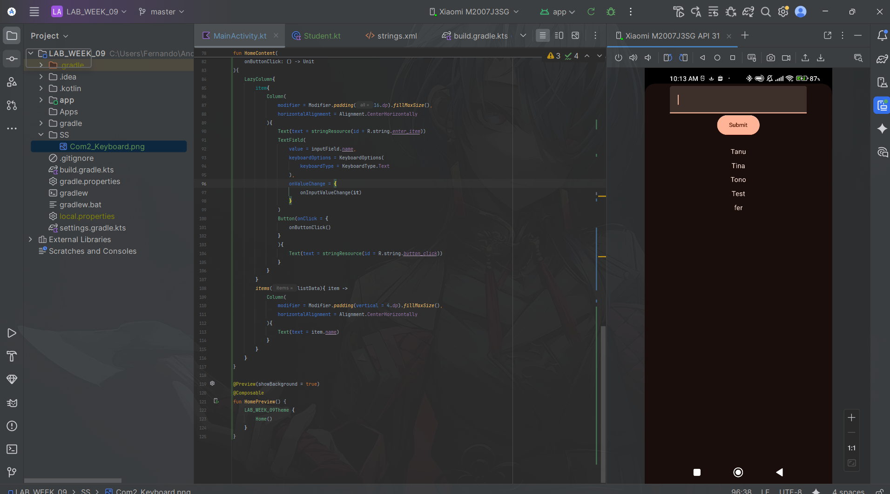
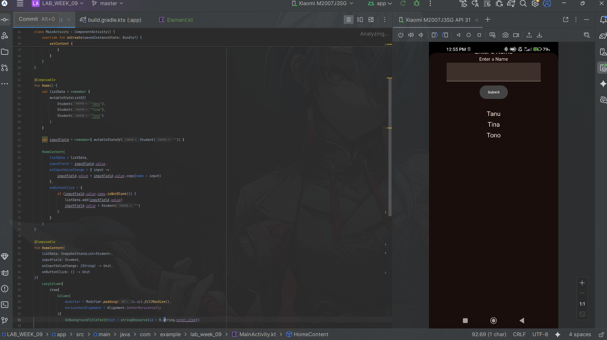
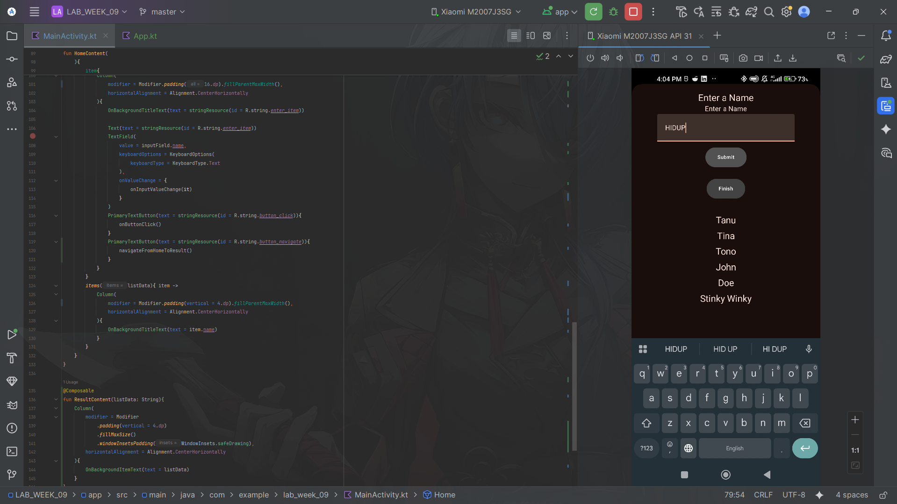
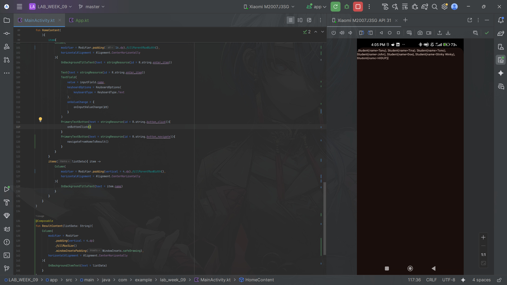
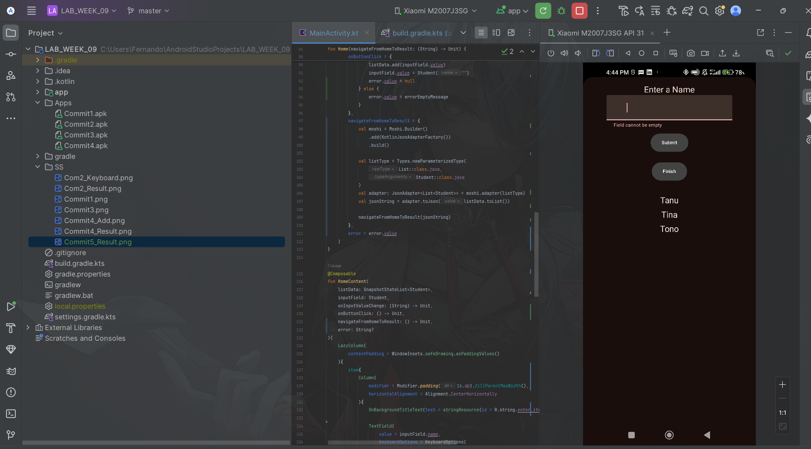
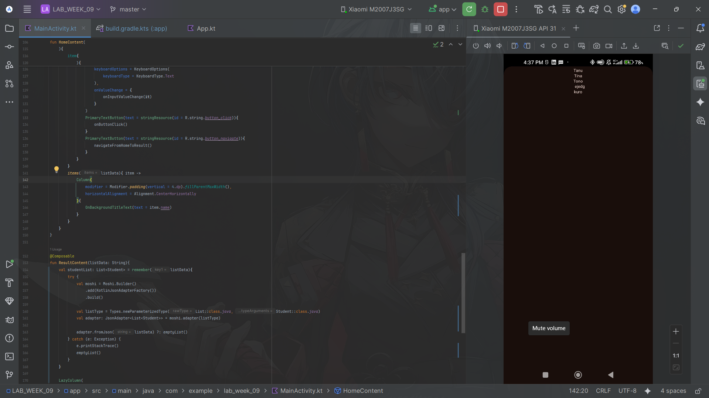

### Submitted by:
* **Nama:** Fernando Sunarto
* **NIM:** 00000083441
* **Class:** AL
---

### Project Files
| Commit | Description | APK Download | Screenshot Preview |
| :---: |---------------------------------------------|:---:|:---:|
| **01** | **Commit 1** | [📱 Download APK](Apps/Commit1.apk) | |
| **02** | **Commit 2 - Keyboard** | [📱 Download APK](Apps/Commit2.apk) | |
| **02** | **Commit 2 - Result** | [📱 Download APK](Apps/Commit2.apk) | |
| **03** | **Commit 3** | [📱 Download APK](Apps/Commit3.apk) | |
| **04** | **Commit 4 - Add** | [📱 Download APK](Apps/Commit4.apk) | |
| **04** | **Commit 4 - Result** | [📱 Download APK](Apps/Commit4.apk) | |
| **05** | **Commit 5 - Type** | [📱 Download APK](Apps/Commit5.apk) | |
| **05** | **Commit 5 - Result** | [📱 Download APK](Apps/Commit5.apk) | |

---

### Code that Changed for Assignment
1. Add Moshi Libary into build.gradle.kts:
```diff
  implementation(libs.androidx.navigation.compose)
+ implementation(libs.moshi.kotlin)

  testImplementation(libs.junit)
```
---

2. Add Some Import for MainActivity.kt:
```diff
+ import androidx.compose.foundation.layout.fillMaxWidth
+ import com.squareup.moshi.JsonAdapter
+ import com.squareup.moshi.Moshi
+ import com.squareup.moshi.kotlin.reflect.KotlinJsonAdapterFactory
+ import com.squareup.moshi.Types
```

---

3. Add some error value + Handle on MainActivity.kt:
```diff
  val inputField = remember{ mutableStateOf(Student("")) }
+ val error = remember { mutableStateOf<String?>(null) }
+ val errorEmptyMessage = stringResource(id = R.string.error_empty)
```
```diff
HomeContent(
        listData = listData,
        inputField = inputField.value,
        onInputValueChange = { input ->
            inputField.value = inputField.value.copy(name = input)
+           if (error.value != null) {
+               error.value = null
+           }
        },
        onButtonClick = {
            if (inputField.value.name.isNotBlank()) {
                listData.add(inputField.value)
                inputField.value = Student("")
+               error.value = null
+           } else {
+               error.value = errorEmptyMessage
            }
        },
+       navigateFromHomeToResult = {
+           val moshi = Moshi.Builder()
+               .add(KotlinJsonAdapterFactory())
+               .build()

+           val listType = Types.newParameterizedType(
+               List::class.java,
+               Student::class.java
+           )
+           val adapter: JsonAdapter<List<Student>> = moshi.adapter(listType)
+           val jsonString = adapter.toJson(listData.toList())
+           navigateFromHomeToResult(jsonString)
+       },
+       error = error.value
    )
}

```

---

4. Change navigateFromHomeToResult in MainAcitivy.kt:

From:
```diff
- navigatedRomHhomeToResult: () -> Unit
```
To:
```diff
+ navigateFromHomeToResult: () -> Unit,
+   error: String?
```

---

5. Add Information showed into bottom of form if user fill its blank:
```diff
 TextField(
                    value = inputField.name,
                    keyboardOptions = KeyboardOptions(
                        keyboardType = KeyboardType.Text
                    ),
                    onValueChange = {
                        onInputValueChange(it)
                    },
+                   isError = error != null,
+                   supportingText = {
+                       if (error != null) {
+                           Text(
+                               text = error,
+                               color = MaterialTheme.colorScheme.error,
+                               modifier = Modifier.fillMaxWidth()
+                           )
+                       }
                    }
                )
```

---
6. Change Compose for the ResultContent:
```diff
fun ResultContent(listData: String){
+   val studentList: List<Student> = remember(listData){
+       try {
+           val moshi = Moshi.Builder()
+               .add(KotlinJsonAdapterFactory())
+               .build()

+           val listType = Types.newParameterizedType(List::class.java, Student::class.java)
+           val adapter: JsonAdapter<List<Student>> = moshi.adapter(listType)

+           adapter.fromJson(listData) ?: emptyList()
+       } catch (e: Exception) {
+           e.printStackTrace()
+           emptyList()
+       }
+   }

+   LazyColumn(
        modifier = Modifier
            .padding(vertical = 4.dp)
            .fillMaxSize()
            .windowInsetsPadding(WindowInsets.safeDrawing),
        horizontalAlignment = Alignment.CenterHorizontally
    ){
+       if (studentList.isEmpty()) {
+           item {
+               OnBackgroundItemText(text = "No data received.")
+           }
+       } else {
+           items(studentList) { student ->
+               OnBackgroundItemText(text = student.name)
+           }
+       }
    }
}
```
---
7. Add string for Empty String:
```diff
    <string name= "enter_item">Enter a Name </string>
    <string name= "button_click">Submit</string>
    <string name= "button_navigate">Finish</string>
+   <string name="error_empty">Field cannot be empty</string>
```
